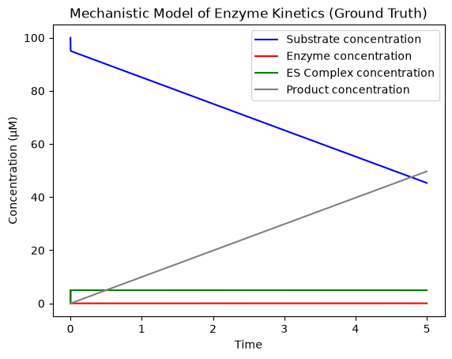
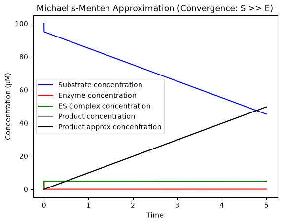
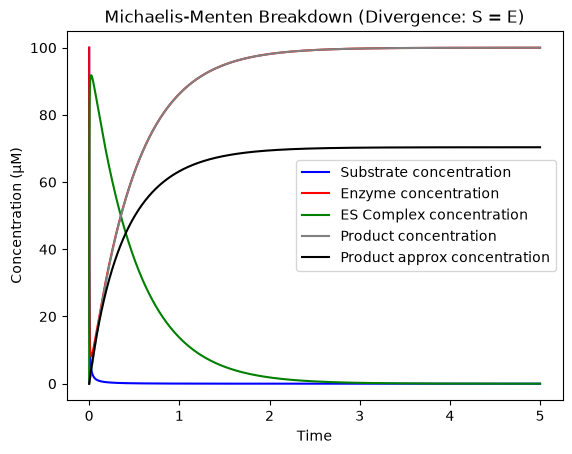

Building a Mechanistic Enzyme Kinetics Engine

Why I Built This
Coming from a life sciences background, I've spent a lot of time working around biological systems, but I learn best by actually building things from the ground up. Instead of just memorizing the standard Michaelis-Menten (M-M) equation for a portfolio project, I wanted to computationally derive it myself.

The goal of this project was to build the raw, undisputed physics of a chemical reaction using Ordinary Differential Equations (ODEs) as a "ground truth," and then overlay the Michaelis-Menten approximation to physically see exactly when the math works, and more importantly, when it completely breaks down.

The Process & The Math
I started by drafting the logic in a Jupyter Notebook so I could run the engine step-by-step before modularizing it into a final .py script.

The reaction follows this standard path:

𝐸 + 𝑆 ⇌ 𝐸𝑆 → 𝐸 + 𝑃

I built the engine around three specific rate constants: 
k1(binding), 𝑘2(dissociation), and k3 (catalysis). 

One of the biggest early takeaways was strictly enforcing the Law of Mass Action and the conservation of mass. If an enzyme and substrate bind, they are consumed from the free pool (requiring negative signs in the ODEs), ensuring that the total enzyme in the system never magically increases ( 𝐸𝑡𝑜𝑡𝑎𝑙 = 𝐸 + 𝐸𝑆). I verified this explicitly at every timestep rather than assuming it — total enzyme stayed constant to within floating-point precision (~1e-13 drift) across every run.

I broke the project into three distinct tasks:

Task 1: The Ground Truth (Mechanistic Model)

I wrote a continuous-time simulation calculating the instantaneous rates of change for Substrate (S), Enzyme (E), Complex (𝐸𝑆), and Product (𝑃). This required carefully tracking the negative and positive flow of molecules to prevent numerical leaks, and I confirmed mass conservation (𝐸+𝐸𝑆=𝐸𝑡𝑜𝑡𝑎𝑙) held throughout every simulation as a correctness check.

Task 2: Proving the Approximation (Convergence)

To derive the Michaelis-Menten shortcut, I needed to test the Quasi-Steady-State Assumption (QSSA) — the assumption that only holds when enzyme is present in small, catalytic amounts relative to substrate (𝐸0 ≪ 𝑆0). I started the simulation with 100 Substrate and only 5 Enzyme (𝑆 ≫ 𝐸).

As seen in the graph below, the ES complex quickly reaches and holds a plateau, and free substrate tracks total remaining unconverted substrate closely throughout. Because this condition held, the black Michaelis-Menten approximation line tracked the grey mechanistic ground-truth line closely — final product concentrations agreed to within ~1.4% (99.99 vs. 98.58, mechanistic vs. approximation).

> 

Task 3: Breaking the Math (Divergence)

To find exactly when the standard textbook approximation fails, I flipped the ratio hard: I set Enzyme in 2x excess over Substrate (S=100, E=200) — the opposite of the condition the M-M equation assumes.

With enzyme this abundant, most of the substrate is pulled into the ES complex almost immediately, but the reverse reaction (k2) keeps a small, steady pool of free substrate in circulation — a pool that turns out to be *comparable in size to Km*, rather than negligible next to it. Because the M-M approximation only ever looks at instantaneous free substrate relative to 𝐾𝑚 — with no way to "see" that most of the reaction's real mass is now sitting in complex form or already converted — it kept calculating a substantial reaction rate long after the true system had effectively run out of convertible material.

The result: the mechanistic model correctly plateaued near P≈100 (all substrate mass converted), while the M-M approximation diverged by two orders of magnitude, running away to over 11,000 by the end of the simulation. This is the QSSA failing exactly where the textbook condition says it should — not from a coding error, but from the approximation's blindness to substrate mass trapped in the ES complex.
> 

The Core Engine

Instead of relying on pre-built solvers, I built the numerical integration loop from scratch, tracking running state separately from initial conditions so I could validate mass conservation against the true starting values at every step.

(Full implementation and visualization logic are available in model.py and the Jupyter notebook).

# 1. Mechanistic ODEs (Ground Truth)
ds  = -(k1 * e_current * s_current * dt) + (k2 * es_current * dt)
de  = -(k1 * e_current * s_current * dt) + (k2 * es_current * dt) + (k3 * es_current * dt)
des =  (k1 * e_current * s_current * dt) - (k2 * es_current * dt) - (k3 * es_current * dt)
dp  =  (k3 * es_current * dt)

# 2. Michaelis-Menten Approximation
vmax = k3 * (e_current + es_current)
v    = (vmax * s_current) / (km + s_current)
dp_approx = v * dt